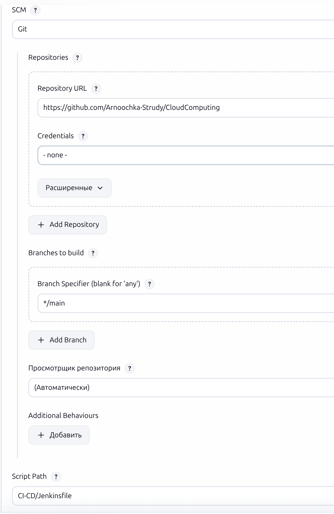
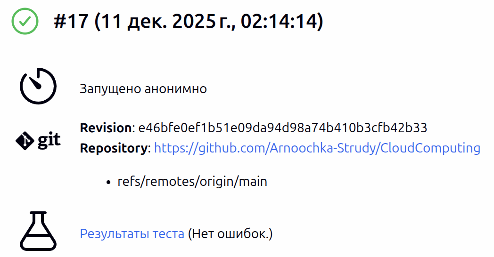

# Простой CI/CD Pipeline на Jenkins

### Стадии Pipeline
 1. Запуск Python кода
 2. Проведение тестов
 3. Создание Docker образа и проверка его работоспособности
 5. Push в docker-hub

### 1.Запуск docker с Jenkins

```bash
docker compose up -d --build 
```

и переходим на [http://localhost:8000](http://localhost:8000)

### 2.Переходим в Jenkins и скачиваем следующие инструменты

 * Pipeline
 * Git
 * Email Extension
 * Docker
 * DOcker Pipeline
 * JUnit

### 3.Коммитим репозиторий на Github или Gitlab

### 4.В Jenkins добавляем Pipeline 

 1. Добавляем сссылку на Github

 2. Добавляем ветку, на которой будет работать Pipeline

 3. Добавляем путь до Jenkinsfile

 4. В Jenkinsfile добавляем в `PROJECT_DIR` директорию Jenkinsfile



### 5. Добавляем данные docker-hub

 1. Получаем на docker-hub токен с правами на чтение и запись
 2. переходим по ссылке [http://localhost:8080/manage/credentials/store/system/](http://localhost:8080/manage/credentials/store/system/) 
 3. Нажимаем на Global credentials (unrestricted) и добавляем никнейм на docker-hub и токен

 ### 6. Запускаем Pipeline в Jenkins



**Дополнительно:** Логи работы Pipeline представлены в `jenkins.log`
